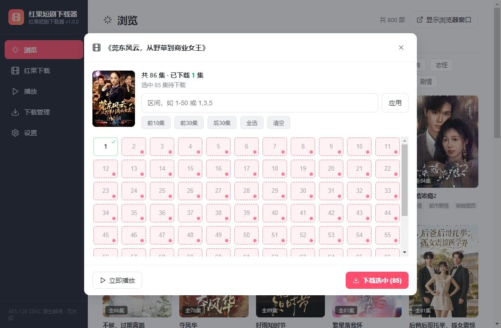
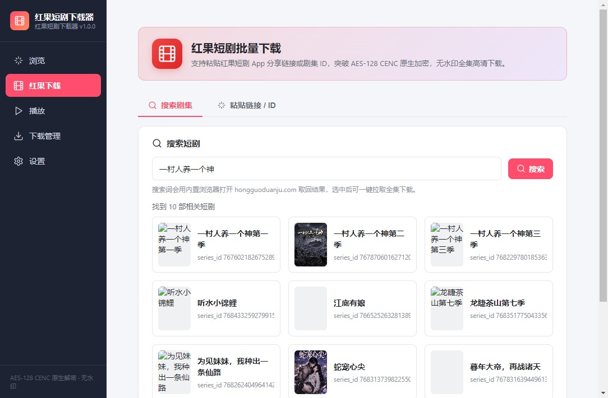
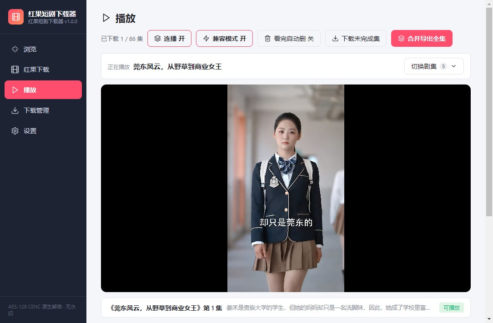
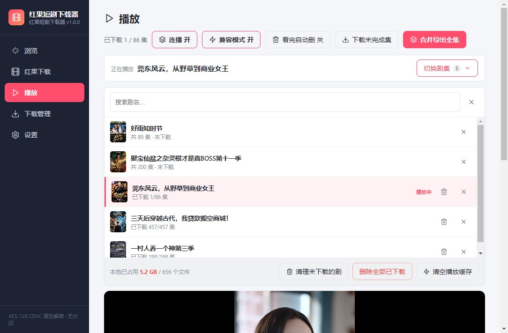
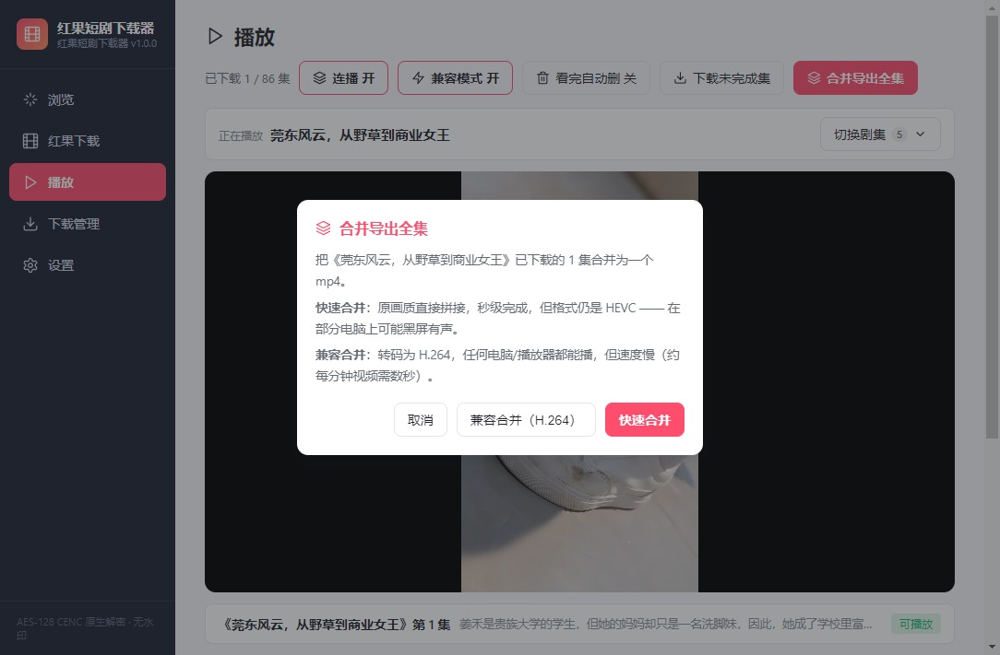
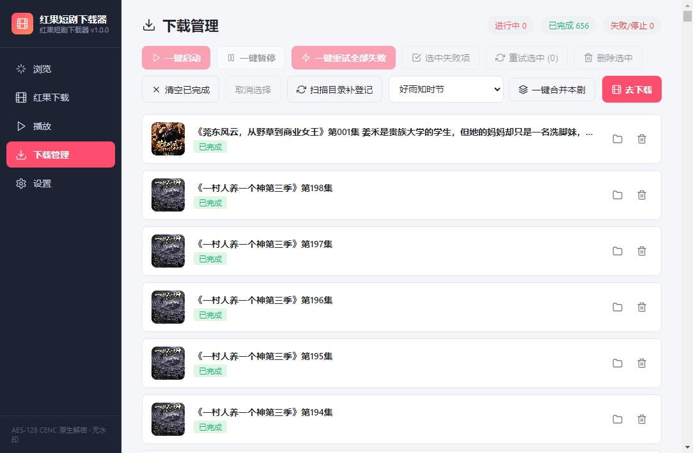
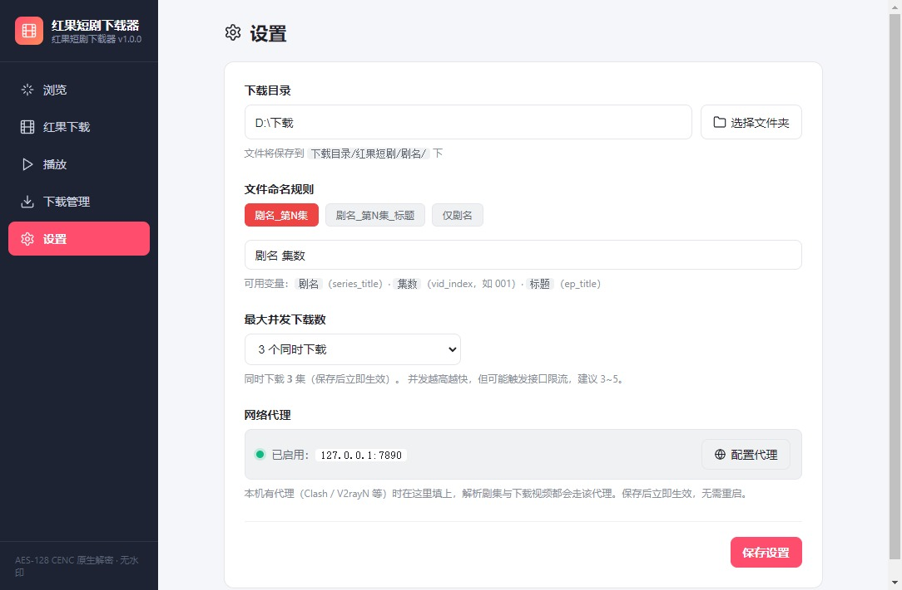

# 🎬 红果短剧下载器（Windows 桌面版）

<div align="center">


**浏览 · 搜索 · 批量下载 · 在线播放 · 一键合并 · 磁盘清理**

原生 CENC-AES-CTR 流式解密 · 原画无水印 · 边下边看 · 内置 ffmpeg

</div>

---

## 📖 简介

面向 **红果短剧（番茄小说短剧频道 / novelread 系）** 的 Windows 桌面工具。

采用 **Electron + React + Node.js** 架构，内置字节系短剧 API 协议与
**CENC-AES-CTR 原生流式解密引擎**：可浏览/搜索剧集、按选集批量下载并自动解密为
无水印 MP4，配合内置播放器、在线播放与一键合并，形成「发现 → 下载 → 观看 → 清理」的完整闭环。

> **来源与修改声明**：本仓库是 [327044572/hongguo-downloader](https://github.com/327044572/hongguo-downloader)
> 的**修改版本**（修改自 2026 年 9 月起），依照 GPL-3.0 第 5(a) 条声明。具体修改内容见
> [NOTICE](NOTICE)，本版本整体继续以 **GPL-3.0** 授权。

---

## 🖼️ 界面预览

### 🔍 浏览 —— 像淘剧一样找片

按分类（真人剧 / 漫剧 / AI剧 / 漫画）与题材（都市 / 逆袭 / 古装 / 玄幻…）筛选浏览，
卡片显示封面、总集数与**已下载进度**（右上角绿色角标），底部按真实页数分页。


### 📺 剧集详情 —— 点开即拉全集

点开任意一部自动解析全部集数，网格展示每集状态；支持前 10 / 前 30 / 后 30 集快捷选择，
也可用区间语法（如 `1-50`、`1-10, 25, 30-45`）批量勾选，或直接「立即播放」。



### 🔎 搜索 —— 输入剧名即可

输入剧名后用内置浏览器嗅探搜索结果，卡片点选即进入选集下载。



### ▶️ 播放器 —— 边下边看

下载完一集就能看，不必等整部下完。顶部依次是**连播开关、兼容模式、看完自动删**、
下载未完成集、合并导出；剧集未下载时点一下即可**在线播放**（不写入磁盘）。



### 🗂️ 剧集管理 —— 切换 / 查看占用 / 删除

「切换剧集」展开管理面板：可搜索剧名、查看每部剧的已下载进度与磁盘占用，
并逐部删除本地文件或从列表移除，底部还有批量清理入口。



### 🔗 合并 —— 快速或兼容

合并全集时可选两种模式：**快速合并**（原画质直拼，秒级完成）或
**兼容合并**（转码为 H.264，任何电脑/播放器都能播）。



### 📋 下载管理 —— 队列与管控

顶部实时显示「进行中 / 已完成 / 失败」；工具栏支持**一键启动、一键暂停、
一键重试全部失败、选中失败项、扫描目录补登记、一键合并本剧**等操作。



### ⚙️ 设置 —— 目录 / 命名 / 并发 / 代理

下载目录、文件命名模板、最大并发数，以及网络代理（跟随系统 / 手动指定 / 强制直连），
保存后均立即生效，无需重启。



---

## ✨ 功能总览

### 一、🔍 发现剧集

| 方式 | 说明 |
|---|---|
| **浏览**（推荐） | 按分类（真人剧 / 漫剧 / AI剧 / 漫画）+ 题材筛选，卡片式浏览官网列表，支持分页（一页 24 部） |
| **搜索** | 输入剧名，内置浏览器嗅探搜索结果，封面卡片点选即用 |
| **粘贴链接 / ID** | 支持 App 分享链接、含引导文案的长文本、纯数字 `series_id` |

- 点开任意一部即自动拉取**全集列表**（剧名、封面、总集数、每集标题与 `vid`），并写入本地剧集档案
- 嗅探只依赖链接里的 `series_id`，不依赖站点样式类名，站点改版不易失效
- 失败时可「显示浏览器窗口」人工兜底

### 二、🎯 选集与下载

- **快速选集**：全选 / 反选 / 清空 / 前 10 集 / 前 30 集 / 后 30 集
- **区间语法**：`1-50`、`1-10, 25, 30-45`、`1, 3, 5, 7, 9`
- **单集点选**：网格徽章逐集勾选
- **并发下载**：1~10 线程并行（默认 3），队列自动顺延
- **原生解密**：`spade_a` 密钥派生 + CENC-AES-CTR 流式解密，直接输出标准 MP4，无需二次转码
- **防损机制**：先写 `.enc.tmp`，解密成功后才改名为 `.mp4`，中途断网不会留下残缺文件

### 三、▶️ 播放

**内置播放器**（左侧栏「播放」）

- 直接播放本地已下载分集，**下载完一集即可观看**，不必等整部下完
- **播完自动播下一集**；下一集若正在下载，显示进度并在下完后**自动接上**
- **断点续播**：记住每部剧看到第几集、第几秒
- **快捷键**：`空格` 播放/暂停 · `←` `→` 快退/快进 5 秒 · `↑` `↓` 上一集/下一集 · `A` 切换连播
- **剧集管理面板**：「切换剧集」展开，可搜索、切换、查看各剧占用、删除文件或从列表移除

**在线播放（不落盘）**

- 未下载的分集**点一下即可在线播放**，不写入下载目录
- 实现方式：CENC 加密视频无法直接交给播放器，改为在**内存中完成「下载 + 解密」**，
  再经自定义协议 `hongguo-stream://` 按 Range 供给播放器
- 内存缓存上限 300MB，按 LRU 自动淘汰，支持拖动进度条，可一键清空

**兼容模式（解决「黑屏有声」）**

- 平台视频为 **HEVC** 编码，Chromium 在 Windows 上只能靠硬件解码；
  显卡不支持或被 GPU 黑名单拦截时会出现「有声音但黑屏」
- 第一层：主动开启平台 HEVC 解码并放宽 GPU 黑名单
- 第二层：仍无法解码时，自动用内置 ffmpeg 把该集**转码为 H.264** 后播放并缓存
  - 编码器自动探测：`nvenc` / `qsv` / `amf` / `mf` 逐个**实际试编一帧**验证，不可用则回退 `libx264`
  - 转码缓存上限 4GB，自动淘汰
- 界面有「兼容模式 开/关」开关（默认开）

### 四、📋 下载管理

- **状态追踪**：等待中 / 下载中 / 已完成 / 失败 / 已停止
- **实时进度**：已下载 / 总大小、百分比进度条
- **一键启动 / 一键暂停**：暂停会取消进行中的任务并清空队列；启动把未完成任务重新排队
- **实时并发指示**：「正在并发下载 N / 上限」
- **启动自动续跑**：软件启动后自动接着跑上次未下完的任务
- **一键重试全部失败**
- **任务操作**：停止 / 重试 / 打开文件夹 / 删除
- **扫描目录补登记**：把磁盘上已有但列表里没有的文件补回任务列表（任务记录丢失时自愈）

### 五、🔗 一键合并

把某剧已下载的分集合并为单个 MP4，方便一次看完，不用一集集切换。

- 入口：「下载管理」工具栏 `一键合并本剧`、播放器页 `合并导出全集`
- **快速合并**：ffmpeg 流复制拼接（`-c copy`），无损且极快（198 集约 **17 秒**）
- **兼容合并**：转码为 H.264，任何电脑/播放器都能播（较慢）
- 合并前校验**磁盘空间**与**编码一致性**，合并后校验输出可解析
- 按集号数字排序，自动跳过未下载的集；**按磁盘实际文件合并**（含无任务记录的孤儿文件）
- 内置 ffmpeg，无需用户自行安装

### 六、🧹 磁盘清理

- **按剧删除**：剧集面板里一键删掉该剧全部本地文件（含合并产物、残留临时文件，空目录一并删除）
- **单集删除** + **看完自动删**开关：边看边清，磁盘不堆积
- **删除任务时可勾选**「同时删除本地文件」，并显示可释放空间
- **占用统计**：实时显示本地占用（如 `5.21 GB / 655 个文件`），支持「删除全部已下载」
- 删除文件后**保留剧集档案**，之后仍可在线播放或重新下载
- 移除列表与删除文件是两个独立操作，不会误删

### 七、⚙️ 设置

- **下载目录**：任意磁盘 / 移动硬盘，自动按 `下载目录/红果短剧/剧名/` 归档
- **文件命名模板**：`剧名 集数` / `剧名 集数 标题` / `仅剧名`，支持 `{series_title}` `{vid_index}` `{ep_title}`
- **最大并发数**：1~10（默认 3），保存立即生效
- **网络代理**：
  - 三种模式：**跟随系统**（环境变量）/ **手动指定**（支持账号密码）/ **强制直连**
  - 内置常见代理端口预设（Clash 7890 / V2rayN 10809 / Shadowsocks 1080 / Burp 8080）
  - 「测试连接」即时验证并显示耗时
  - 保存后**立即生效，无需重启**，覆盖 API 解析、视频下载与窗口图片加载

---

## 💻 普通用户：直接使用

1. 下载 **绿色版 zip**，解压到任意目录
2. 双击解压出来的 **`红果短剧下载器.exe`**
3. 无需安装 Node.js 或其他环境

> 应用数据保存在 `%APPDATA%\hongguo-downloader\`，卸载/删除程序目录不会丢失下载记录与设置。

---

## 🛠️ 开发者：本地运行与构建

### 环境要求

- Windows 10 / 11 x64
- Node.js >= 18（推荐 20.x / 22.x）
- npm >= 9

### 本地开发

```powershell
git clone https://github.com/327044572/hongguo-downloader.git
cd hongguo-downloader
npm install
npm run dev        # 同时启动 Vite 前端与 Electron 客户端
```

### 打包构建

```powershell
# 1) 准备内置 ffmpeg（约 88MB，不入库，只需执行一次）
node scripts/setup-ffmpeg.js

# 2) 非管理员环境需执行一次（见下方「winCodeSign 解压失败」）
node scripts/setup-winCodeSign.js

# 3) 按需打包
npm run build             # NSIS 安装包
npm run build:zip         # 绿色版 zip（推荐分发）
npm run build:dir         # 仅免安装目录 dist/win-unpacked
npm run build:portable    # 便携单文件 exe
npm run zip               # 仅重新压缩已有的 win-unpacked
```

### 产物对比

| 产物 | 大小 | 说明 |
|---|---|---|
| `红果短剧下载器-1.0.0-win-x64.zip` | ~158 MB | **绿色版 zip**：解压即用，启动最快，**推荐分发** |
| `红果短剧下载器-Setup-1.0.0.exe` | ~116 MB | **NSIS 安装包**：建快捷方式、可改安装目录、可卸载 |
| `红果短剧下载器-1.0.0-便携版.exe` | ~108 MB | **便携单文件**：双击即用，但每次启动要自解压，较慢 |
| `win-unpacked/` | ~421 MB | 未压缩的绿色版目录（zip 的来源） |

> zip 内已套好顶层文件夹 `红果短剧下载器-1.0.0/`，解压不会把文件散落一地。

---

## ❓ 常见问题

### 播放页黑屏但有声音

视频是 **HEVC** 编码，你的显卡/驱动不支持硬件解码。应用已内置「兼容模式」：
播放时会自动检测，若解不出画面则用 ffmpeg 转码为 H.264 后播放（首次转码需几秒，之后走缓存）。

也可在播放页手动点「兼容模式」确认开关状态，或点击画面上的「转码后播放」。

### 合并出来的大文件拖进度条会卡

Chromium 对超长 HEVC 视频的 seek 支持有限。合并文件本身是完好的（时长/编码均已校验），
**从头连续看没有问题**；需要拖进度时请用播放器的分集列表（单集 seek 正常），
或用 PotPlayer / VLC 等本地播放器打开。

### 分发到别的电脑后没有画面

确保使用最新版本（已内置兼容模式）。若仍有问题，检查播放页「兼容模式」是否为「开」。

### Windows 打包失败：`Cannot create symbolic link`

`winCodeSign-2.6.0.7z` 内含两个 **macOS** 用的符号链接
（`darwin/10.12/lib/libcrypto.dylib`、`libssl.dylib`）。Windows 创建符号链接需要
管理员权限或「开发者模式」，普通权限下 7-Zip 会以退出码 2 结束，导致打包中止。

解决办法（任选其一）：

1. **推荐**：`node scripts/setup-winCodeSign.js` 预解压到固定目录，再打包时带上环境变量：
   ```powershell
   $env:DSH_WINCODESIGN_DIR='<项目路径>\.eb-cache\winCodeSign\winCodeSign-2.6.0'
   npm run build
   ```
   （macOS 符号链接缺失不影响 Windows 打包，实际只用 `windows-10/` 与 `rcedit-*.exe`）
2. 以管理员身份运行终端，或开启 Windows「开发者模式」后直接打包。

### 打包报错 `Access is denied`

应用正在运行，占用着 `dist/win-unpacked` 里的文件。先完全退出程序再打包。

### 升级后下载列表空了，但文件还在

点「下载管理 → 扫描目录补登记」，或重启应用（启动时会自动从磁盘补回记录）。
只要文件在，记录可以重建。

---

## 📂 项目结构

```text
├── main.js                       # Electron 主进程：API 解析、下载编排、解密、合并、
│                                 #   在线播放内存流、兼容转码、文件清理
├── preload.js                    # IPC 通信桥（contextBridge）
├── index.html                    # 渲染进程入口
├── vite.config.js
├── src/
│   ├── App.jsx                   # 主界面与侧边栏导航
│   ├── main.jsx
│   ├── index.css                 # 全局样式与主题变量
│   ├── store.js                  # 本地持久化（设置 / 任务 / 剧集档案 / 播放进度 / 合并记录）
│   ├── native/
│   │   └── hongguo.js            # 核心协议：API 解析、spade_a 密钥派生、
│   │                             #   CENC-AES-CTR 解密（文件版 + 内存版）
│   └── components/
│       ├── Browse.jsx            # 浏览页：分类 / 题材 / 分页 / 详情抽屉
│       ├── SearchPanel.jsx       # 搜索页（内嵌浏览器嗅探）
│       ├── HongguoDownload.jsx   # 下载页：搜索/链接切换、选集、提交
│       ├── Player.jsx            # 播放器：本地/在线播放、连播、兼容模式、剧集管理
│       ├── DownloadManager.jsx   # 下载管理：队列、进度、合并、删除、补登记
│       ├── Settings.jsx          # 设置：目录、命名、并发、代理
│       └── icons.jsx             # SVG 图标库
├── scripts/
│   ├── dev.js                    # 开发模式启动器（Vite + Electron）
│   ├── setup-ffmpeg.js           # 下载内置 ffmpeg（不入库）
│   ├── setup-winCodeSign.js      # 预解压 winCodeSign，绕过符号链接限制
│   ├── make-zip.js               # 打绿色版 zip（含顶层文件夹）
│   └── verify-best-def.js        # 调试脚本：验证清晰度选流逻辑（parseModelVideo）
├── build/
│   ├── icon.png                  # 应用图标
│   └── ffmpeg/                   # 内置 ffmpeg
│                                 #   二进制由 setup-ffmpeg.js 生成（不入库）
│                                 #   许可文本（COPYING.* / LICENSE.md / FFMPEG-NOTICE.txt）随源码入库
├── NOTICE                        # 来源与修改声明（GPL-3.0 §5a）
├── THIRD-PARTY-NOTICES.md        # 第三方组件许可清单
├── docs/screenshots/             # README 用界面截图
├── dist/                         # 打包输出（.gitignore）
└── 红果视频刷访问量/             # 附带的协议分析与播放量研究工具集
```

---

## ⚖️ 免责声明

1. 本工具仅供**学习交流与个人备份**使用，严禁用于商业盗版、非法传播或任何侵犯第三方权益的行为。
2. 红果短剧及番茄系平台拥有作品的全部版权，通过本软件获取的内容版权仍归原平台及创作者所有。
3. 平台接口策略可能随时调整，若解析失效请关注上游仓库更新。
4. 使用本软件产生的一切后果由使用者自行承担。

---

## 📄 开源许可证与第三方组件

### 本软件

本项目基于 [327044572/hongguo-downloader](https://github.com/327044572/hongguo-downloader)
二次开发，**整体以 [GNU General Public License v3.0 (GPL-3.0)](LICENSE) 发布**。

作为 GPL-3.0 的修改版本，本仓库遵循以下要求：

| 要求 | 落实方式 |
|---|---|
| 保留许可证与版权声明 | 仓库根目录 [`LICENSE`](LICENSE)（GPL-3.0 全文） |
| **声明已修改及日期**（§5a） | 仓库根目录 [`NOTICE`](NOTICE)，列明修改内容与起始时间 |
| 整体继续以 GPL-3.0 授权（§5c） | 本仓库及全部产物均为 GPL-3.0，不附加额外限制 |
| 分发二进制时提供对应源码（§6） | 源码在本仓库公开；第三方组件源码地址见下 |

### 第三方组件

| 组件 | 许可证 | 说明 |
|---|---|---|
| Electron / React / axios | MIT | 运行时依赖 |
| **FFmpeg** | **GPLv3** | 内置（合并与转码用），源码见 [ffmpeg.org](https://ffmpeg.org/download.html) |

- 完整的第三方许可清单：[`THIRD-PARTY-NOTICES.md`](THIRD-PARTY-NOTICES.md)
- 分发包内已随附：`LICENSE.txt`、`NOTICE.txt`、`THIRD-PARTY-NOTICES.md`（与主程序同目录），
  以及 `resources/bin/` 下 FFmpeg 的 `COPYING.GPLv3` / `COPYING.GPLv2` /
  `COPYING.LGPLv2.1` / `LICENSE.md` / `FFMPEG-NOTICE.txt`

> 内置的 FFmpeg 构建参数含 `--enable-gpl --enable-version3`，因此其许可证为 GPLv3。
> 本软件仅通过命令行调用其公开接口，未修改 FFmpeg 源码。
